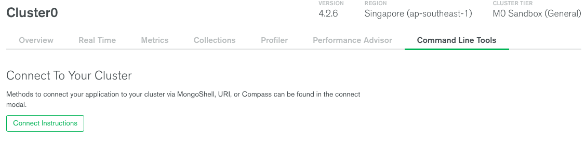

# Fundamental Pipeline Aggregation for MongoDB with pymongo

For this workshop, we shall be going through reading the database using the `.aggregate()` method on a database collection and finding out who stole the sacred BuildingBloCS Logo. [Click here to see the storyline](https://github.com/joelleoqiyi/BBCS-X-NoSQL/tree/master/Part1)

Before we go through how to use pipeline aggregation with NoSQL, we need to import our possible suspects (in names.json)

In MongoDB Atlas,
1) Click on your cluster name and then click `Command Line Tools`. You should see something like this:



2)Scroll down till `Data Import and Export Tools` and copy the command line code for `mongoimport` (we are **importing** data using the `mongoimport` function)

  - It should look something like this:
```
mongoimport --host Cluster0-shard-0/cluster0-shard-00-00-d8ikq.mongodb.net:27017,cluster0-shard-00-01-d8ikq.mongodb.net:27017,cluster0-shard-00-02-d8ikq.mongodb.net:27017 --ssl --username <username> --password <PASSWORD> --authenticationDatabase admin --db <DATABASE> --collection <COLLECTION> --type <FILETYPE> --file <FILENAME>
```
Paste
```
import pymongo

client = pymongo.MongoClient(<MongoDB server here>)
```
If you're running your MongoDB server locally, then by default your local MongoDB IP address and port is `'127.0.0.1', 27017` respectfully. If you wanna connect to the MongoDB Atlas as explained in the workshop then please follow the instructions in the README.MD in the root of this repository.

For this ~~cheatsheet~~ example, our database will be consumables, collection be food, and documents be banana.
## Create

In MongoDB, creating a database/collection has the same function as routing to it.

 **Creating/Connecting to a database within a client**
```
Consumables_database = client.get_database('Consumables')
```
In the above code snippet, `Consumable_database` is merely a variable placeholder in the pymongo command line... You can call it whatever you want as long as it's easy to understand. For me I follow the convention <databasename>_database so that it's easier to understand._

  As for `client.get_database('Consumables')`, Consumables is the name of the database you want to create/connect to.

   **Creating/Connecting to a collection within a database**
  ```
  Fruits_collection = Consumables_database.get_collection('Fruits')
  ```
  The naming convention follows similarly for the earlier snippet, nothing much to explain here.

  Remember I am only creating one collection for this example, you can create as many collections as you want within a database. So lets   say you wanna make a drinks collection just do `Drinks_collection = Consumables_database.get_collection('Drinks')`

   **Adding documents into a collection**

  To insert documents into a collection, we use the following function:
  ```
  Fruits_collection.insert_one({"Item" : "Banana", "Weight" : 300, "Price" : 3, "Colour" : "Yellow", "Length" : 10})
  ```
  If you want to insert multiple documents instead you can just use `.insert_many(data1, data2, data3, etc)`.  

  You realise that documents come in the form of dictionaries. If you don't already know yet, dictionaries are like arrays but instead of having a single element in each index of the array, dictionaries have a key-value pair representing an element in the dictionary.

  Inserting just one document into the collection seems readible enough. But when you want to insert multiple documents at once, it may become too hard to read and therefore we can use the alternative:

  Assign multiple documents into an array, separated by commas. Then just `insert_many(array)`

  For example:
  **Creating an array to be inserted all at once into the fruits collection**
  ```
  manystuff = [{
    "Item" : "Banana",
    "Weight" : 300,
    "Price" : 3,
    "Colour" : "Yellow",
    "Length" : "10cm" #Dynamic schema! :o
    }, {
    "Item" : "Apple",
    "Weight" : 50,
    "Price" : 0.30,
    "Radius" : "5cm" #Dynamic schema! :o
    }, {
    "Item" : "Grapes",
    "Weight" : 100,
    "Price" : 10 ,
    "Colour" : "Green",
    "Bundle_Quantity" : 42

    }]
```
**Inserting all those documents into the fruits collection**
```
fruits_collection.insert_many(manystuff)
```
Remember earlier I said connecting and creating databases/collections have the same function? If you connect to an existing collection/database, then it just connects to it normally. But if you try to connect to a non-existent collection/database, then it will just create a new one **PROVIDED THAT YOU INSERT AT LEAST ONE DOCUMENT**, or else nothing will happen :)

Now, let's move on to reading data in MongoDB.

## Read

Here you will learn how to view data in your MongoDB server.

**Listing all databases in a client**
```
print(client.list_database_names())
```
**Listing all collections in a databse**
```
print(consumabes_database.list_collection_names())
```
`xxx.list_xxx_names()` Would return the list of databases/collections in an array.
**Listing all documents in a collection**
```
fruits_collection.find()
```
Yes unfortunately it's not `fruits_collection.list_documents_names()` unlike for databases and collections, it's different because it's like that.

*Also*, printing `fruits_collection.find()` will not return you a nice array like databases and collections. To view the data easier, we run a for loop through it and printing each element, which will print the whole document nicely.
```
print('Listing documents in the fruits collection...')
for documents in fruits_collection.find():
  print(documents)
```
**Listing specific documents in a collection**

Earlier I have shown you that we just list all documents in the fruits collection. What if you want to just view fruits that are yellow colour? We use specific queries in the `.find()` method like so:
```
Yellow_fruits = fruits_collection.find({"Colour" : "Yellow"})
for fruits in Yellow_fruits:
  print(fruits)
```

**Advanced queries!! :DDD**

Now that you have learned how to list specific documents, you know how to find fruits that weigh 300g. What if you want to find fruits that weigh less than 300g? Like this..
```
Light_fruits = fruits_collection.find({"weight" :{"$lt" : 300}})
for fruits in Light_fruits:
  print(fruits)
```
And if you want to find fruits whose letters start with S or later, do this..
```
Special_condition_fruits = fruits_collection.find({"name" : {"$regex" : "^S"}})
for fruits in Special_condition_fruits:
  print(fruits)
```
Here is a table for conditionals/queries that you can utilise to get exactly what data you want to find. :)

| Conditional   | Purpose|
| ------------- |:-------------:|
| $eq      |Equals to|
| $gt      |Greater than|
| $gte      |Greater than or equal to|
| $lt      |Less than|
| $lte      |Less than or equal to|
| $ne     |Not equal|
| $in      |In a specific list|
| $nin      |Not in a specific list|
| $or      |Logical OR|
| $and      |Logical AND|
| $exists     |Matches documents which has the named field|

With that in mind lets find out how we can update values in our database

## Update

Want to change some of your data because they're outdated? Use the following functions to update documents.

**Updating one document**
```
Fruits_collection.update_one({"name" : "banana"} , {$set : {"name" : "awesome_banana"}})
```
`{"name" : "banana"}` is the conditional if the document that you want to update, and `{"name" : "awesome_banana}` is what you want your updated value to be.

Updating just one value is weird, this is how to update many values. Suppose the inflation rate is hitting you hard and the rise in the unit cost of production of fruits signals fruit firms like you to increase the market price of your fruits:

**Updating many documents**
```
Fruits_collection.update_many({"price" : {"$lte" : 3.00} , {$set : {"price" : 4.00}})
```

## Delete

Deleting documents is very similar to updating documents because you just have to simply change `update_one/many` to `delete_one/many`.

**Deleting one document
```
Fruits_collection.delete_one({"name" : "banana"})
```
**Deleting many documents**
```
Fruits_collection.delete_many({"name" : "banana"})
```
##

And here concludes the end of our MongoDB tutorial Part 2! :). For any questions, feel free to ask us on Discord
